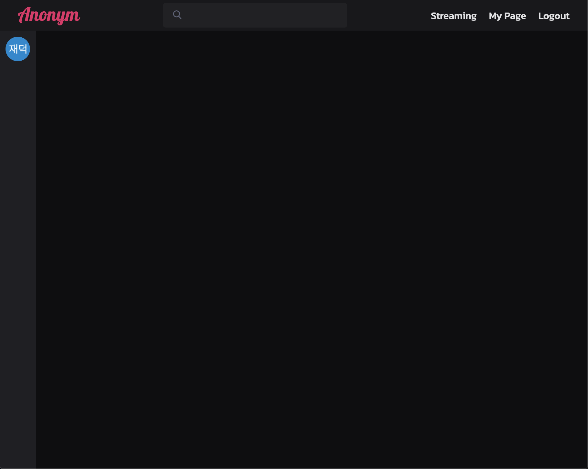
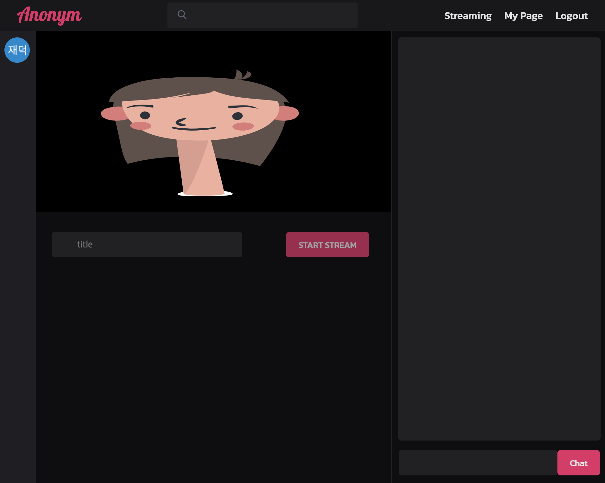
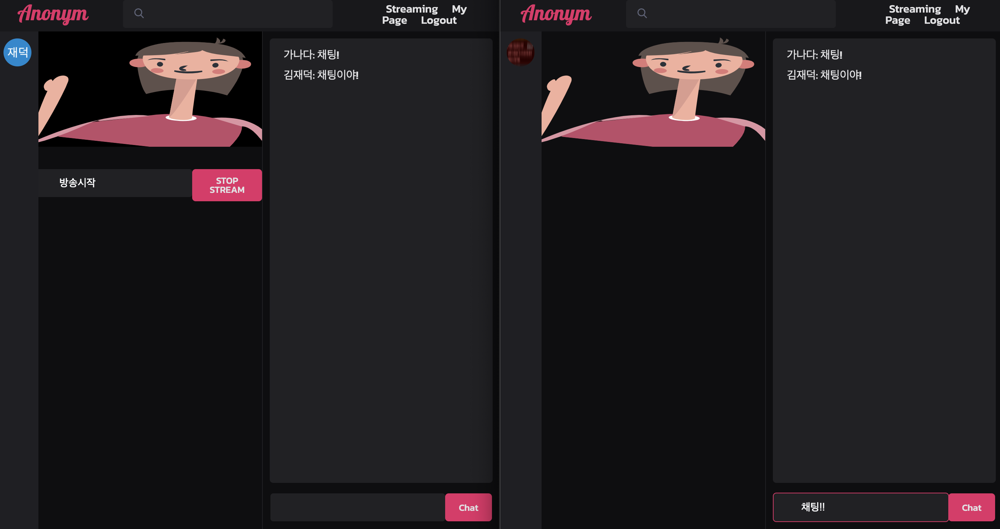
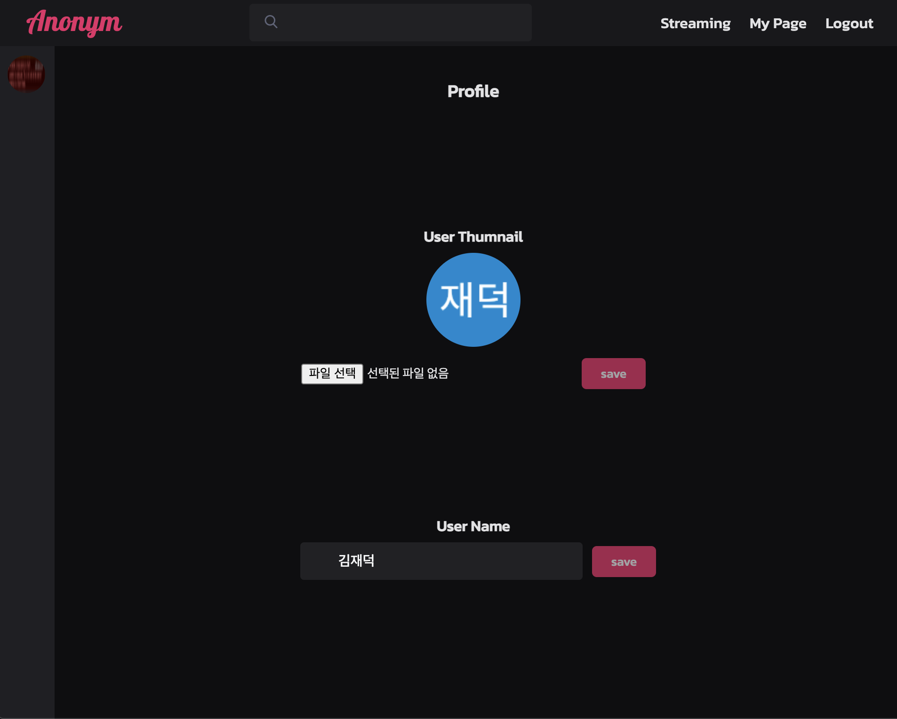
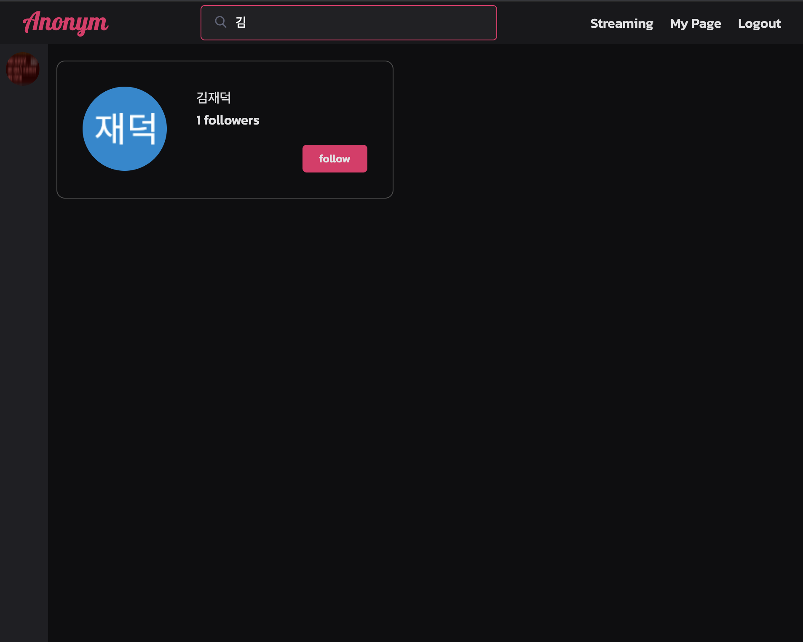
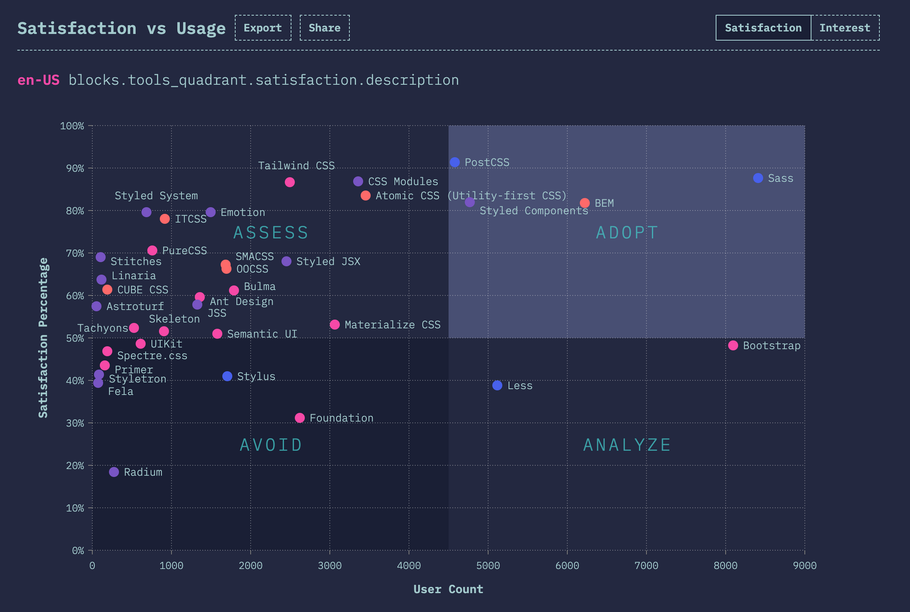
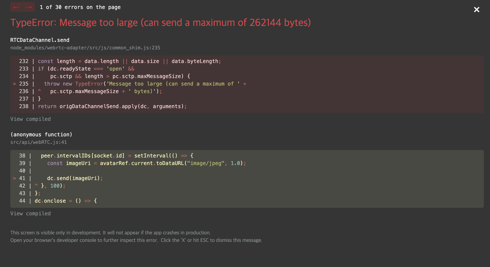
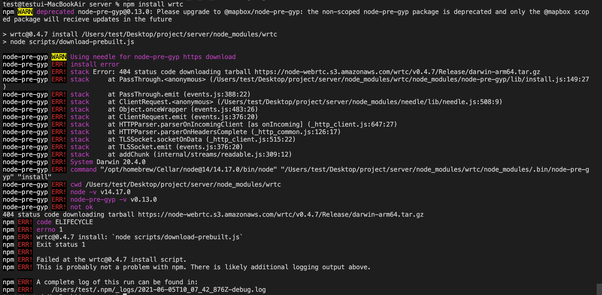

# Anonym

Anonym은 유저의 실물 대신 캐릭터를 송출하는 스트리밍 서비스입니다.

 

Deploy Site :[**https://anonym.life**](https://anonym.life)

Github Repositories : [**https://github.com/avatar-streaming**](https://github.com/avatar-streaming)

 

## 프로젝트 동기
최근 늘어가는 스트리밍에 대한 관심과 수요와 함께\
스트리밍을 하면서 익명성을 보장받고 싶은 사람들을 위해\
실물 대신 캐릭터를 송출하는 스트리밍 서비스를 제공하면\
라디오 방송보다 더 역동적인 스트리밍이 될 수 있겠다고 생각하여 기획하게 되었습니다.

 

## 기술 스택
**[Front-end]**

- React
- Redux (thunk, toolkit)
- SCSS
- Tensorflow
- WebRTC
- socket.io-client

**[Back-end]**

- Node.js
- Express
- wrtc
- socket.io
- JsonWebToken
- MongoDB

 

## 프로젝트 기간

- **기획 :** 2021 / 05 / 03 ~ 2021 / 05 / 09 **(1주간)**
    - **1주차 -**  아이디어 및 기술스택 검토

- **개발 :** 2021 / 05 / 10 ~ 2021 / 05 / 21 **(2주간)**
    - **2주차 -** <React> Component, UI / <Server> CRUD / <TensorFlow> PoseAnimator 적용
    - **3주차 -** <WebRTC> Streaming  / <Socket> Chatting

 

## 주요 기능 및 시연 영상

[바닐라코딩 부트캠프 9기 최종 프로젝트 Stand-up Event](https://www.youtube.com/watch?v=F8OHnevCS30&t=13148s)

`3: 39: 10`부터 주요 기능과 프로젝트 플로우에 대한 설명을 보실 수 있습니다.

|                                                             |                                                              |
| ------------------------------------------------------------|------------------------------------------------------------- |
|메인 페이지에서는 현재 진행 중인 방송 리스트를 랜덤으로 10개 보여줍니다.|상단의 `streaming`을 클릭하면 `streaming page`로 이동하고 스트리밍을 위한 준비가 시작됩니다. 로딩이 끝나면 캔버스에 캐릭터가 그려지고 `title`을 입력하면 `start stream` 버튼을 클릭하여 streaming을 `on / off` 할 수 있습니다.|
| 방송에 참여하면 스트리머의 움직임과 목소리가 전달되며 채팅창을 통해 방송 참가자들과의 실시간 채팅이 가능합니다.| 상단의 `profile`을 클릭하면 사용자의 `thumnail`과 `user name`을 바꿀 수 있습니다. |
| 상단의 검색창을 통해 유저를 검색할 수 있으며 `follow / unfollow`가 가능합니다.
| |

 

## 기술

### SCSS

`The State of CSS 2020`에서 CSS의 트렌드를 확인해 봤습니다.

`CSS-in-JS`와 `CSS-in-CSS`를 기준으로\
사용량과 만족도가 높은 `Styled Component`와 `Sass`를 고민하던 중\
조사 결과 `Styled Component`는 CSS와 JS가 분리되어있지 않기 때문에\
Component를 rendering할때
style도 같이 road되는 특징이 있는 것을 확인했습니다.

만약, 굉장히 동적인 이벤트가 많은 웹사이트가 있다면\
그만큼 Component의 상태 값 전환도 활발하며,\
Component interaction이 활발할수록 자주 렌더링 될 것입니다.

이러한 웹사이트에서 `CSS-in-JS`를 사용한다면\
그만큼 스타일 정보도 다시 읽어와야 하므로 성능 저하가 발생합니다.

이번 프로젝트는 특정 페이지의 경우\
상태 값 전환으로 인한 rendering이 활발하게 일어나기 때문에\
처음에는 스타일 정보를 가져오는 양이 많더라도 `CSS-in-CSS`인 `Sass`를 사용하기로 했습니다.

 

### WebRTC
이번 프로젝트는 실시간성이 중요한 스트리밍 서비스이기 때문에\
`WebRTC`를 통해 스트리밍을 구현하기로 했습니다.

`WebRTC`는 데이터 통신이 필요한 Peer들을 1:1로 연결하는 P2P 프로토콜입니다.\
Signaling을 제외하면 통신을 위해 서버를 경유할 필요가 없어서 빠르게 실시간 통신이 가능합니다.

문제는 N:N 통신의 경우 `Mesh` 형태로 트래픽이 발생하여\
`uplink`와 `downlink`가 N 개만큼 필요하기 때문에\
통신 인원이 많을수록 클라이언트의 부하가 심해진다는 것입니다.

이는 대규모의 스트리밍 서비스에는 적합하지 않은 방식이며,\
이러한 문제점을 해결하기 위해 스트리밍에 적합한 `SFU(Selected Foward Unit)` 방식으로 구현했습니다.

`SFU` 구현을 위해 `mideasoup`과 같은 라이브러리를 사용할 수도 있겠지만\
학습 차원에서 midea server를 직접 구현했습니다.

 

## History
### - dataChannel 용량 제한 -

`webRTC`의 `dataChannel`을 통해 데이터를 전송할 때는 `256kb`라는 용량 제한이 존재합니다.

이번 프로젝트는 스트리밍 서비스지만 캐릭터를 송출해야 하기 때문에\
`video stream`을 전달하는 것이 아니라 `character image`를 전달해야 했습니다.

그래서 첫 번째 솔루션은 `streamer`의 `canvas`에서 이미지를 추출하여 `viewer`에게 전송하는 것이었는데\
캔버스 이미지를 `base64`의 `string`으로 추출해서 전송하는 첫 번째 솔루션이\
이러한 용량 제한 때문에 문제가 생겨서 `Tensorflow`를 통해 얻은\
`streamer`의 좌표값을 `viewer`에게 보내서 `character`를 `rendering` 하는 방법으로 우회했습니다.

하지만 원하는 결과가 나오지 않아 `streamer` 쪽 `canvas`에서 이미지를\
`비트맵이 아닌 벡터 그래픽`으로 추출하는 방법으로 해결하였습니다.

https://www.notion.so/WebRTC-DataChannel-1653659ae3544505a80ed356dc7769eb

### - wrtc m1 이슈 -

스트리밍의 `SFU` 구조를 구현하기 위해서 `server` 쪽에 `peer`를 만들어야 했기 때문에\
`server`에서 `webRTC`를 사용할 수 있게 해주는 `wrtc`라는 라이브러리를 사용했습니다.\
사용하던 맥북을 수리 맡긴 상황에 임시로 m1 맥 북을 사용하면서 프로젝트를 install하던 중에 문제가 생겼습니다.

이슈를 해결하기 위해 에러 메세지에서 설명하는 해결책과 검색한 결과들을 시도해봤지만 해결되지 않았고\
문제의 원인과 해결방안을 검색하던 중 해당 라이브러리의 `github issue`에 `m1` 관련 글이 몇 개 보이는 것을 확인했습니다.

혹시나 하는 마음에 `intel cpu`를 사용하는 맥으로 `install`을 시도했고 문제가 발생하지 않는것을 알았습니다.

이번 이슈를 통해 하드웨어와 소프트웨어의 버전과 같은 호환성관리가 중요한 문제임을 실감했습니다.

https://github.com/node-webrtc/node-webrtc/issues/698
 

## 프로젝트 소감
팀 프로젝트 때와 달리 서비스의 모든 부분은 혼자서 구현하고자 하니
많은 작업량과 시간에 대한 압박이 있었습니다.\
그와 더불어 짧은 시간 내에 완성시켜야 했기에 팀으로 했을 때보다 디테일을 신경 쓰기 어려운 부분이 있었습니다.

특히, 스트리밍의 경우 실시간 서비스이기 때문에 언제 어떤 문제가 생길지 예측할 수 없는데\
많은 유저들을 동시에 다루는 실제 서비스들이 정말 대단하다는 생각을 했습니다.

이번 프로젝트는 웹이 지닌 기능을 많이 활용하는 프로젝트였기 때문에\
웹이 가진 잠재력을 엿볼 수 있었고 웹을 잘 알게 된다면 더 재미있는 시도들이 가능할 것 같습니다.
