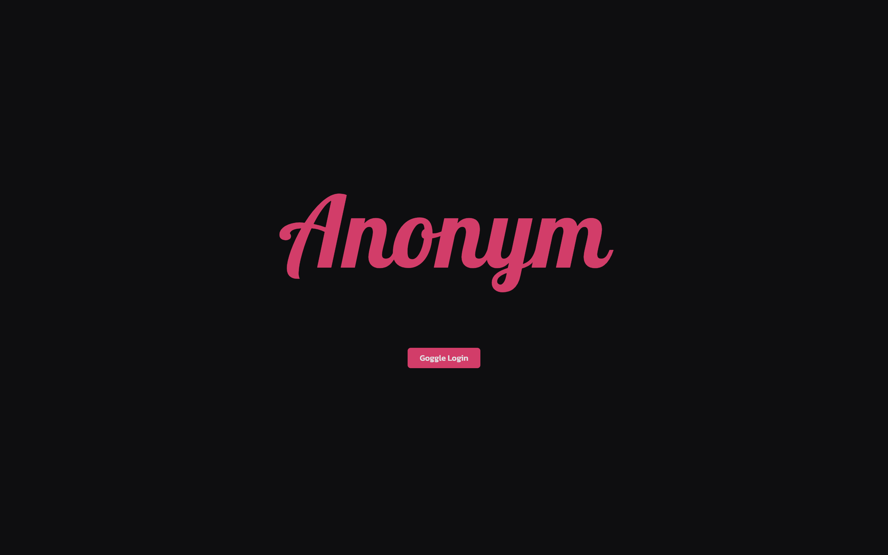
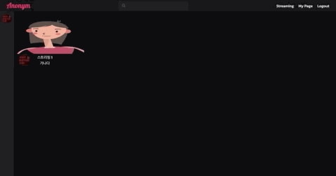
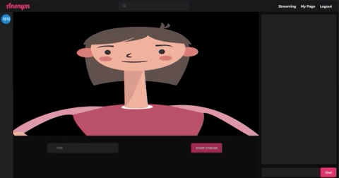
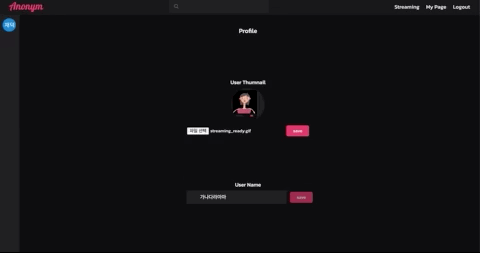
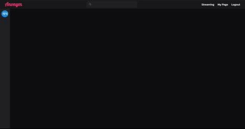

# 🤡 Anonym

Anonym은 유저의 실물 대신 캐릭터를 송출하는 스트리밍 서비스입니다.

 

🔗 Deploy Site :[**https://anonym.life**](https://anonym.life)

🔗 Github Repositories : [**https://github.com/avatar-streaming**](https://github.com/avatar-streaming)

🔗 Anonym 시연 영상 : [**https://www.youtube.com/watch?v=F8OHnevCS30&t=13147s**](https://www.youtube.com/watch?v=F8OHnevCS30&t=13147s)

 

## 🔥 프로젝트 동기
최근 늘어가는 스트리밍에 대한 관심과 수요와 함께\
스트리밍을 하면서 익명성을 보장받고 싶은 사람들을 위해\
실물 대신 캐릭터를 송출하는 스트리밍 서비스를 제공하면\
라디오 방송보다 더 역동적인 스트리밍이 될 수 있겠다고 생각하여 기획하게 되었습니다.

 

## 🦾 기술 스택

| **[Front-end]**        | **[Back-end]**          |
| :--------------------- | :---------------------  |
| ES2015+                | NodeJS                  |
| React                  | Express                 |
| React-router-dom       | MongoDB                 |
| Redux (Redux-toolkit)  | Mongoose                |
| Redux-thunk            | JWT (JSON Web Token)    |
| tensorflow             | cross-env               |
| Firebase               |                         |
| prop-types             |                         |
| node-sass              |                         |
| Jest                   |                         |
| React-testing-library  |                         |
| redux-mock-store       |                         |

 

## 📆 프로젝트 기간

  **기획 :** 2021 / 05 / 03 ~ 2021 / 05 / 09 **(1주간)**
- **1주차 -**  아이디어 및 기술스택 검토, UX/UI, DB Schema 설계

 

**개발 :** 2021 / 05 / 10 ~ 2021 / 05 / 21 **(2주간)**
  - **2주차 -** TensorFlow PoseAnimator 적용, WebRTC Streaming,  Socket Chatting
  - **3주차 -** 배포, 테스트 코드 작성, 코드 리펙터링

 

## 🌟 주요 기능

|                                                             |                                                              |
| ------------------------------------------------------------|------------------------------------------------------------- |
| 메인 페이지에서는 현재 진행 중인 방송 리스트를   랜덤으로 10개 보여줍니다.| 상단의 `streaming`을 클릭하면 `streaming page`로 이동하고 스트리밍을 위한 준비가 시작됩니다.   로딩이 끝나면 캔버스에 캐릭터가 그려지고  `title`을 입력하면 `start stream` 버튼을 클릭하여 streaming을 `on / off` 할 수 있습니다.|
|  방송에 참여하면 스트리머의 움직임과 목소리가 전달되며   채팅창을 통해 방송 참가자들과의 실시간 채팅이 가능합니다.|  상단의 `profile`을 클릭하면 사용자의 `thumnail`과 `user name`을 바꿀 수 있습니다. |
|    상단의 검색창을 통해 유저를 검색할 수 있으며   `follow / unfollow`가 가능합니다.
| |

 

## 🌈 프로젝트 배포

Front-end
- Netlify를 사용하여 애플리케이션 배포 및 관리

Back-end
- AWS Elastic Beanstalk를 사용하여 애플리케이션 배포 및 관리
Amazon ACM (AWS Certificate Manager)을 사용하여 SSL 관리
AWS 파이프라인 연결 후 배포 자동화 구현

 

## 📝 기술 기록

### 실시간 스트리밍 (WebRTC)
- 이번 프로젝트는 실시간성이 중요한 스트리밍 서비스이기 때문에 `WebRTC`를 통해 스트리밍을 구현하기로 했습니다.
- 스트리밍은 1:N 통신인데 `Mesh` 형태로 구현한다면 `uplink`와 `downlink`가 N 개만큼 필요하기 때문에 통신 인원이 많을수록 클라이언트의 부하가 심해진다는 것입니다.
- 이는 대규모의 스트리밍 서비스에는 적합하지 않은 방식이며, 이러한 문제점을 해결하기 위해 스트리밍에 적합한 `SFU(Selected Foward Unit)` 방식으로 구현해야 했습니다.
- `SFU` 구현을 위해 `mideasoup`과 같은 라이브러리를 사용할 수도 있겠지만 학습 차원에서 media server를 직접 구현했습니다.
- socket으로 signaling 하였고 server에서도 wrtc를 사용할 수 있게 해주는 wrtc라는 라이브러리를 이용하였습니다.
- 1:N 구조를 구현해야 했기 때문에 server에 peer를 만들어 streamer와 연결하여 streamer의 방송데이터를 server에 있는 peer로 전송하는 방식을 선택했습니다.
- 방송에 시청자가 들어오면 서버의 peer와 시청자의 peer를 생성하여 연결하는 방식으로 server를 경유하는 1:N streaming을 구현했습니다.
- server에 peer를 만들어 webrtc 통신을 구현하였는데 webrtc는 보안상의 이유로 localhost와 https서버로만 통신이 가능하다는 문제 때문에 production level에서 webrtc 통신이 되지 않는 문제가 생겼습니다.
  - 문제 해결을 위해 향후 mideasoup을 이용하여 https 프로토콜의 midea server를 구현하려고 합니다.
- 스트리밍을 구현하면서 클라이언트와 서버를 넘나들며 코드를 작성했는데 인자값 등을 혼동하는 경우가 굉장히 많았고 많은 에러 메세지를 마주했습니다. 타입스크립트와 같은 언어의 필요성을 절실히 느꼈고 유지보수를 위해서라도 꼭 적용하고자 합니다.
- 유저의 실물이 아니라 캐릭터를 송출해야 하기 때문에 canvas의 이미지를 toDataUrl로 추출하여 dataChannel을 통해 전송하는 방법을 선택했습니다. 프로젝트 데모데이에 발표 중 에러가 발생했는데 dataChannel의 용량초과 에러가 발생한 것으로 확인했습니다.
  - 스트리밍 품질 유지와 문제 해결을 위해 이미지 대신 유저의 모션 좌표값을 전송하여 시청자들에게 렌더시키는 방법을 취했습니다. 하지만 생각했던것 보다 렌더링 비용이 커서 다른 방법을 고민해 보았습니다.
  - canvas에서 이미지를 추출할때 png로 추출을 했었는데, 이미지 품질 저하 문제와 용량 초과 문제가 있었습니다.
  - 고민끝에 비트맵 이미지가 아닌 벡터 그래픽을 추출하는 방법을 생각해냈고 캔버스에서 sgv포맷으로 이미지를 추출하여 스트리밍 품질과 용량문제를 모두 해결했습니다. 놀라운 점은 svg파일의 용량이 문제 해결 전의 10분의 1조차 되지 않는 다는 점이었습니다.
- 사용하던 맥북을 수리 맡긴 상황에 임시로 m1 맥 북을 사용하면서 프로젝트를 install하던 중에 문제가 생겼습니다.
  - 이슈를 해결하기 위해 에러 메세지에서 설명하는 해결책과 검색한 결과들을 시도해봤지만 해결되지 않았습니다.
  - 문제의 원인과 해결방안을 검색하던 중 해당 라이브러리의 `github issue`에 `m1` 관련 글이 몇 개 보이는 것을 확인했습니다.
  - 혹시나 하는 마음에 `intel cpu`를 사용하는 맥으로 `install`을 시도했고 문제가 발생하지 않는것을 알았습니다.
  - 이번 이슈를 통해 하드웨어와 소프트웨어의 버전과 같은 호환성관리가 중요한 문제임을 실감했습니다.
https://github.com/node-webrtc/node-webrtc/issues/698

 

### 컴포넌트 스타일링 (SCSS)

- 어떤 방식의 컴포넌트 스타일링을 선택할지 고민하고 있었습니다.
- `Styled Component`를 사용해 보고 난 후로는 선호하는 스타일이 되었는데 `조사 결과 `Styled Component`는 CSS와 JS가 분리되어있지 않기 때문에 Component를 rendering할때 style도 같이 road되는 특징이 있는 것을 확인했습니다.
- 이번 프로젝트가 동적인 이벤트가 많은 프로젝트는 아니지만 구현해야 하는 기능 중 채팅 창과 같은 기능은 state 변화로 인한 rerendering이 활발하게 일어날 것이기 때문에 `Styled Component`같은 `CSS-in-JS`는 적합하지 않다고 생각했습니다.
- `The State of CSS 2020`에서 CSS의 트렌드를 확인해 봤습니다.
- `CSS-in-JS`와 `CSS-in-CSS`를 기준으로 사용량과 만족도가 높은 `Styled Component`와 `sass`를 고민하던 중 처음에는 스타일 정보를 가져오는 양이 많더라도 `CSS-in-CSS`인 `sass`를 사용하기로 했습니다.
- `scss`의 문법은 생각보다 편리했습니다. 들여쓰기를 통해 css에서 보다 불필요한 코드가 줄었고 `BEM` 방식을 통해 클래스를 정의하여 사용하면서 수직적이고 명확한 구조로 스타일을 작성할 수 있었습니다.
- 간편하게 theme color를 설정하여 어플리케이션 전체에 동일한 스타일을 적용할 수도 있었고 className을 이용하여 스타일을 toggle하는 기능도 간편하게 구현이 가능한 구조였습니다.
- 아쉬운 점도 역시 있었습니다. className을 작성하는 어려움이 있었고 어플리케이션의 규모가 커지면 스타일 시트도 늘어날텐데 유지보수에서 어려움을 겪지 않을까 하는 생각도 들었습니다.

 

## 프로젝트 소감
팀 프로젝트 때와 달리 서비스의 모든 부분은 혼자서 구현하고자 하니
많은 작업량과 시간에 대한 압박이 있었습니다.\
그와 더불어 짧은 시간 내에 완성시켜야 했기에 팀으로 했을 때보다 디테일을 신경 쓰기 어려운 부분이 있었습니다.

특히, 스트리밍의 경우 실시간 서비스이기 때문에 언제 어떤 문제가 생길지 예측할 수 없는데\
많은 유저들을 동시에 다루는 실제 서비스들이 정말 대단하다는 생각을 했습니다.

이번 프로젝트는 웹이 지닌 기능을 많이 활용하는 프로젝트였기 때문에\
웹이 가진 잠재력을 엿볼 수 있었고 웹을 잘 알게 된다면 더 재미있는 시도들이 가능할 것 같습니다.
